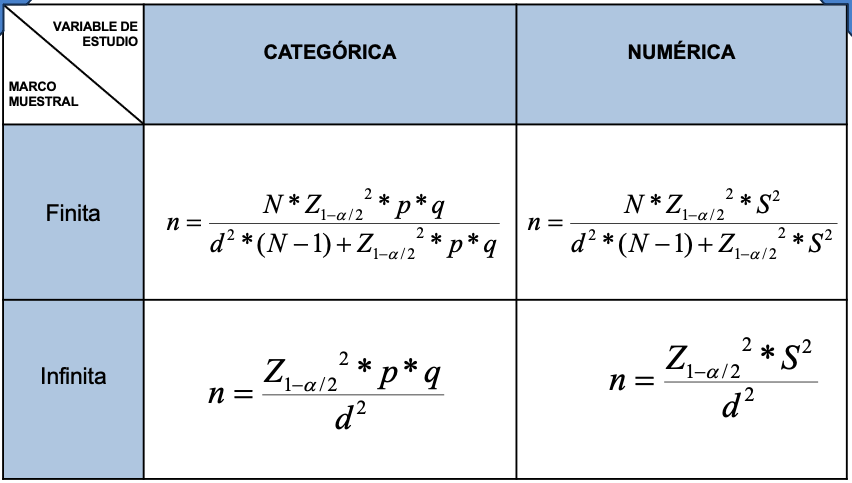

# Marco muestral

- El numero de individuos de la muestra se representa con la letra (n)

* El numero de individuos: es cada uno de los miembros individuales de una población.

- El numero de sujetos de una población se representa con la letra (N)

## Pasos para definir una muestra:

- Definir la población.
- Identificar el marco muestral.
- Determinar el tamaño de la muestra
- Seleccionar un procedimiento de muestreo
- Seleccionar la muestra.

## Tamaño de la muestra segun el tipo de variable

